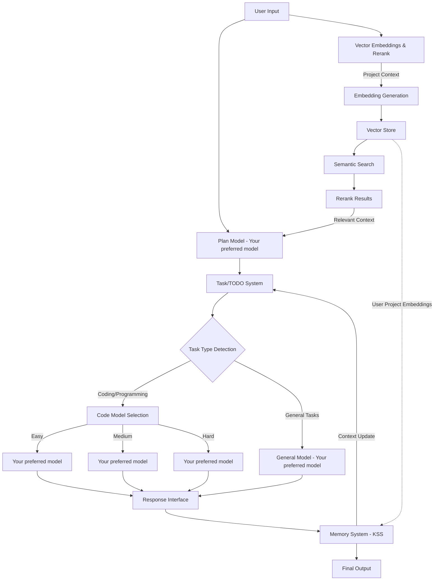

# Knox Memory System (knox-ms) Model

## Overview

**Knox Memory System (knox-ms)** is a revolutionary custom AI model that provides **truly unlimited context window length** through an intelligent memory management system that operates like a human brain. Unlike traditional LLMs constrained by fixed context windows (even with context caching), knox-ms breaks through these limitations by orchestrating multiple underlying models through a sophisticated Plan-Task-Memory architecture.

<iframe width="900" height="600" src="https://www.youtube.com/embed/y10ez14CcI0?si=whude9nfdYNQ79PH" title="YouTube video player" frameborder="0" allow="accelerometer; autoplay; clipboard-write; encrypted-media; gyroscope; picture-in-picture; web-share" referrerpolicy="strict-origin-when-cross-origin" allowfullscreen></iframe>

### Key Innovation: Unlimited Context

The core breakthrough of knox-ms is its **Memory System** - a dynamic, self-updating knowledge base stored in Knox Server System(KSS) that:

- **Functions as a Brain**: Maintains persistent, organized memory across unlimited conversations
- **CRUD Operations**: Creates, Reads, Updates, and Deletes memory entries dynamically based on task execution
- **Context Cache Integration**: Works seamlessly with LLM context caching (prompt caching) to optimize performance
- **Intelligent Memory Management**: Automatically determines what to remember, update, or forget
- **Hierarchical Organization**: Structures information from recent (full detail) to long-term (semantic summaries)

### Architecture Philosophy

```
Memory System (Brain) = Core Intelligence
  ↓ manages and updates
Context Cache (LLM) = Working Memory
  ↓ enhanced by
Vector Embeddings & Rerank (Tool) = Information Retrieval
```

**How It Works**:
1. **Memory System** acts as the persistent brain, storing all session history, plans, and learned patterns
2. **LLM Context Cache** serves as working memory, optimized by the Memory System's intelligent loading
3. **Vector Embeddings** provide tools for retrieving relevant user project context when needed

This architecture allows knox-ms to handle conversations and projects of any scale - from short queries to multi-month development projects - without losing context or hitting token limits.

## Model Identity

```json
{
    "id": "knox/knox-ms",
    "object": "model",
    "created": 1735689600,
    "owned_by": "KnoxChat",
    "root": "knox/knox-ms",
    "parent": null
}
```

## Architecture

### Core Components



### 1. Plan Model

- **Default Model**: `Your preferred model`
- **Purpose**: Analyzes input and creates structured execution plans
- **Output**: Task breakdown with difficulty classification (easy/medium/hard)
- **Responsibilities**:
  - Parse user intent
  - Decompose complex requests into atomic tasks
  - Assign difficulty levels
  - Define execution order and dependencies

### 2. Task/TODO System

Acts as an intelligent task manager that:
- Categorizes tasks by type (coding vs. non-coding)
- Routes tasks to appropriate models based on complexity
- Tracks task progress and status
- Manages task dependencies and execution order
- Records task completion and outcomes

**Task Difficulty Matrix**:

| Difficulty | Model | Use Cases |
|------------|-------|-----------|
| Easy | `Your preferred model` | Simple queries, formatting, basic operations |
| Medium | `Your preferred model` | Moderate complexity, code refactoring, analysis |
| Hard | `Your preferred model` | Complex reasoning, architecture design, advanced coding |

### 3. Vector Embeddings & Rerank System

The Vector Embeddings & Rerank system provides **intelligent context retrieval** from user projects by:

- **Purpose**: Converts user project files, code, and documentation into semantic vectors for intelligent retrieval
- **Scope**: Separate from Memory System - focuses on user's project content, not knox-ms internal state
- **Components**:
  - **Embedding Generation**: Processes user project files into vector embeddings
  - **Vector Store**: Stores embeddings with metadata (file paths, timestamps, types)
  - **Semantic Search**: Retrieves relevant project context based on user query
  - **Rerank Engine**: Re-orders search results by relevance using advanced ranking algorithms

**Vector Embeddings Pipeline**:

1. **Indexing Phase** (on-demand or background):
   ```
   User Project Files → Chunking → VoyageAI Embedding API → Vector Store
   ```
   - Supported file types: `.rs`, `.py`, `.js`, `.ts`, `.md`, `.json`, `.yaml`, etc.
   - Chunk size: 2048 tokens with overlap
   - Embedding models: `voyage-3.5` (general) or `voyage-code-3` (code-focused projects)
   - API: VoyageAI Embeddings API

2. **Retrieval Phase** (per request):
   ```
   User Query → VoyageAI Query Embedding → Semantic Search → Top-K Results → VoyageAI Rerank → Final Context
   ```
   - Top-K: 20-50 candidates from vector search
   - Rerank model: `rerank-2.5` (VoyageAI)
   - Final selection: Top 5-10 most relevant chunks

**Integration with Knox-MS**:
- Feeds relevant project context to Plan Model for better task decomposition
- Provides code examples and patterns for Code Model Selection
- Keeps project-specific knowledge separate from knox-ms internal memory

**Storage Structure**:
```
KSS://knox-ms-vectors/
├── projects/
│   ├── {project_id}/
│   │   ├── metadata.json       # File index and metadata
│   │   ├── chunks/
│   │   │   ├── file_{hash}.json  # Chunked content with embeddings
│   │   └── index/
│   │       └── stats.json      # Indexing statistics
│   └── cache/
│       └── queries/            # Cached query results
```

### 4. Memory System

The Memory System is the **brain of knox-ms** - providing truly unlimited context through intelligent, dynamic memory management:

#### Core Concept: Human-Like Memory

Just as human brains don't store every detail but organize and update memories based on relevance, knox-ms Memory System:

- **Persistent Storage**: KSS-based tree-structured filesystem for unlimited storage
- **Dynamic CRUD Operations**: Continuously Creates, Reads, Updates, and Deletes memory based on task execution
- **Intelligent Organization**: Automatically structures information hierarchically
- **Context-Aware Loading**: Loads only relevant memory into LLM context cache
- **Self-Optimizing**: Summarizes, compresses, and reorganizes memory to maintain efficiency

#### Memory vs. Context Cache vs. Vector Embeddings

| Component | Purpose | Scope | Persistence |
|-----------|---------|-------|-------------|
| **Memory System (Brain)** | Core intelligence, session history, learned patterns | Knox-ms internal state | Permanent (KSS) |
| **LLM Context Cache** | Working memory for current task execution | Current request/task context | Temporary (per request) |
| **Vector Embeddings (Tool)** | Retrieve user project information | User's codebase/docs | Permanent (KSS) |

The Memory System manages what goes into the LLM's context cache, while Vector Embeddings serve as a tool to fetch relevant project information.

#### Dynamic CRUD Operations

The Memory System performs intelligent CRUD operations based on Task execution:

**CREATE (New Information)**:
- New session initialized → Create `session/{session_id}/` directory
- New plan generated → Create `plans/plan_{id}.md`
- New task started → Create `tasks/task_{id}.md`
- Pattern discovered → Create entry in `knowledge/patterns/`

**READ (Context Loading)**:
- Load recent conversation from `history.md`
- Retrieve relevant plans from `plans/`
- Fetch task status from `tasks/status.md`
- Query knowledge base for similar past situations

**UPDATE (Memory Refinement)**:
- Task completed → Update `tasks/task_{id}.md` with results
- Conversation continues → Append to `history.md`
- Context grows large → Update `context.md` with summary
- New pattern matches existing → Update `knowledge/patterns/`

**DELETE (Memory Optimization)**:
- Old temporary files → Delete after summarization
- Redundant information → Remove duplicates
- Failed/cancelled tasks → Archive or delete
- Stale cache entries → Invalidate and remove

#### KSS Storage Structure

- **KSS Storage**: Stores all knox-ms interactions in a tree-structured filesystem on KSS
- **Markdown Files**: All content persisted as `.md` files for human readability
- **Dynamic Updates**: Automatically updates related files based on Plan and Task system execution
- **Separation of Concerns**: 
  - **Memory System (KSS)**: Knox-ms internal state, session history, task records, plans
  - **Vector Embeddings**: User project content, code, documentation for context retrieval

- **Hierarchical Organization** (KSS): 
- **Hierarchical Organization** (KSS):
  ```
  KSS://knox-ms-memory/
  ├── sessions/
  │   ├── {session_id}/
  │   │   ├── context.md          # Current conversation context (optimized for cache)
  │   │   ├── history.md          # Full conversation history
  │   │   ├── tasks/
  │   │   │   ├── task_{id}.md    # Individual task records
  │   │   │   └── status.md       # Task status tracker
  │   │   └── plans/
  │   │       └── plan_{id}.md    # Execution plans
  │   └── summary.md              # Session summary
  ├── knowledge/
  │   ├── code/                   # Code-related memory
  │   ├── concepts/               # Learned concepts
  │   └── patterns/               # Recognized patterns
  └── index.md                    # Global memory index
  ```

#### Context Cache Integration

The Memory System intelligently manages LLM context caching (prompt caching):

**Optimization Strategy**:
1. **Cache-Optimized Loading**: Structure memory to maximize cache hit rates
2. **Stable Prefix**: Keep frequently-used context in stable prefix for caching
3. **Dynamic Suffix**: Append task-specific context that changes per request
4. **Cache Invalidation**: Smart invalidation when memory updates significantly
5. **Token Management**: Balance between cache reuse and fresh context

**Memory → Cache Flow**:
```
Memory System (KSS) 
  → Load relevant memory 
  → Structure for optimal caching 
  → LLM Context Cache (prompt cache)
  → Execute task
  → Update Memory with results
  → Optimize cache structure
```

**Benefits**:
- **Cost Efficiency**: Reuse cached context across requests (lower input token costs)
- **Speed**: Faster response times with cached prompts
- **Unlimited Scale**: Memory System handles what cache cannot (unlimited history)
- **Intelligence**: Memory System decides what to cache vs. what to summarize

#### Memory Capabilities

- **Context Optimization**: Continuously refines and summarizes past interactions
- **Relevant Retrieval**: Extracts only necessary context for current tasks
- **Loop Integration**: Updates continuously during task execution
- **KSS Benefits**: Scalable, durable, cost-effective storage for unlimited memory
- **Cross-Session Learning**: Share knowledge across different sessions
- **Pattern Recognition**: Identify and remember recurring patterns

## API Specification

### Model Object

```json
{
    "architecture": {
        "input_modalities": ["file", "image", "text"],
        "modality": "text+image->text",
        "output_modalities": ["text"],
        "tokenizer": "Claude"
    },
    "context_length": -1,
    "created": 1735689600,
    "id": "knox/knox-ms",
    "object": "model",
    "owned_by": "KnoxChat",
    "parent": null,
    "permission": [
        {
            "allow_create_engine": true,
            "allow_fine_tuning": false,
            "allow_logprobs": true,
            "allow_sampling": true,
            "allow_search_indices": false,
            "allow_view": true,
            "created": 1735689600,
            "group": null,
            "id": "modelperm-knox-ms-001",
            "is_blocking": false,
            "object": "model_permission",
            "organization": "*"
        }
    ],
    "pricing": {
        "completion": "0.000015",
        "image": "0",
        "input_cache_read": "0.0000003",
        "input_cache_write": "0.0000015",
        "internal_reasoning": "0",
        "prompt": "0.000003",
        "request": "0",
        "web_search": "0"
    },
    "root": "knox/knox-ms",
    "supported_parameters": [
        "enable_vector_search",
        "include_reasoning",
        "max_tokens",
        "memory_mode",
        "project_id",
        "reasoning",
        "rerank_threshold",
        "response_format",
        "session_id",
        "stop",
        "structured_outputs",
        "temperature",
        "tool_choice",
        "tools",
        "top_k",
        "vector_top_k",
        "verbosity"
    ],
    "top_provider": {
        "context_length": -1,
        "is_moderated": true,
        "max_completion_tokens": 128000
    }
}
```

### Special Parameters

| Parameter | Type | Description |
|-----------|------|-------------|
| `session_id` | string | Unique session identifier for memory persistence |
| `project_id` | string | User project identifier for vector embeddings retrieval |
| `enable_vector_search` | boolean | Enable vector embeddings search for project context (default: true) |
| `vector_top_k` | integer | Number of vector search candidates to retrieve (default: 30) |
| `rerank_threshold` | float | Minimum rerank score threshold (0.0-1.0, default: 0.5) |
| `memory_mode` | string | Memory strategy: `full`, `summarized`, `selective` |
| `include_reasoning` | boolean | Include task planning reasoning in response |
| `verbosity` | string | Output detail level: `minimal`, `normal`, `verbose` |

### Request Format

```json
{
    "model": "knox/knox-ms",
    "messages": [
        {
            "role": "user",
            "content": "Build a REST API with user authentication"
        }
    ],
    "temperature": 0.7,
    "max_tokens": 8192,
    "stream": true,
    "session_id": "session_abc123",
    "project_id": "proj_xyz789",
    "enable_vector_search": true,
    "vector_top_k": 30,
    "rerank_threshold": 0.5,
    "memory_mode": "full",
    "include_reasoning": true
}
```

### Response Format (Streaming)

```json
{
    "id": "chatcmpl-knox-ms-xxx",
    "object": "chat.completion.chunk",
    "created": 1735689600,
    "model": "knox/knox-ms",
    "choices": [
        {
            "index": 0,
            "delta": {
                "role": "assistant",
                "content": "..."
            },
            "finish_reason": null
        }
    ],
    "knox_ms_meta": {
        "current_task": "task_001",
        "task_status": "in_progress",
        "plan_id": "plan_001",
        "model_used": "Your preferred model",
        "memory_tokens_saved": 45000,
        "vector_search": {
            "enabled": true,
            "chunks_retrieved": 8,
            "rerank_score_avg": 0.78,
            "retrieval_time_ms": 145
        }
    }
}
```

### Response Format (Non-Streaming)

```json
{
    "id": "chatcmpl-knox-ms-xxx",
    "object": "chat.completion",
    "created": 1735689600,
    "model": "knox/knox-ms",
    "choices": [
        {
            "index": 0,
            "message": {
                "role": "assistant",
                "content": "..."
            },
            "finish_reason": "stop"
        }
    ],
    "usage": {
        "prompt_tokens": 150,
        "completion_tokens": 2500,
        "total_tokens": 2650
    },
    "knox_ms_meta": {
        "tasks_completed": 5,
        "plans_executed": 1,
        "total_model_calls": 8,
        "memory_operations": {
            "reads": 12,
            "writes": 5
        },
        "vector_search": {
            "enabled": true,
            "total_chunks_retrieved": 8,
            "rerank_score_avg": 0.78,
            "retrieval_time_ms": 145,
            "project_files_indexed": 342
        }
    }
}
```

## Workflow Details

### 1. Request Processing Flow

```
1. Receive user input
2. Memory System Load (if session_id provided):
   a. READ: Load session context from KSS
   b. READ: Parse relevant history and task status
   c. Structure memory for optimal LLM context caching
   d. Prepare stable prefix (cacheable) + dynamic suffix (new context)
3. Vector Embeddings & Rerank (if project_id provided and enabled):
   a. Generate query embedding from user input via any Vector DB
   b. Perform semantic search in project vector store (KSS)
   c. Retrieve top-K candidate chunks
   d. Rerank results by relevance using any rerank model
   e. Extract top relevant project context
4. Plan Model analyzes input + memory context + project context
   - Uses LLM context cache for efficiency
   - Memory System provides relevant historical context
5. Task/TODO System receives structured plan
6. For each task:
   a. Determine task type (coding/general)
   b. Assess difficulty (easy/medium/hard)
   c. Select appropriate model
   d. UPDATE: Create task record in Memory System (KSS)
   e. Execute task with relevant memory context (cached)
   f. Stream response to user
   g. UPDATE: Write task results to Memory System
   h. UPDATE: Update task status
7. Memory System CRUD Operations:
   a. UPDATE: Append to history.md
   b. UPDATE: Optimize context.md with summary if needed
   c. CREATE/UPDATE: Save learned patterns to knowledge base
   d. DELETE: Remove temporary files
   e. Optimize for next request's context cache
8. Return final response with metadata
```

### 2. Memory Management Flow (CRUD Operations)

```
1. On request start (READ):
   - READ: Load session context from KSS
   - READ: Parse history.md for relevant context
   - READ: Build working context from task status
   - READ: Fetch relevant knowledge base entries
   - Structure loaded memory for LLM context cache optimization
   - Trigger vector search if project_id provided (Tool operation)

2. During execution (CREATE/UPDATE):
   - CREATE: Initialize new task records (tasks/task_{id}.md)
   - UPDATE: Task status in real-time (tasks/status.md)
   - UPDATE: Write intermediate results to task files on KSS
   - UPDATE: Maintain running context summary
   - Cache vector search results for session (Tool cache)
   - UPDATE: Append significant events to history.md

3. On request complete (UPDATE/DELETE/CREATE):
   - UPDATE: Append full interaction to history.md on KSS
   - UPDATE: Optimize context.md (summarize if exceeds threshold)
   - CREATE/UPDATE: Add new patterns to knowledge/patterns/
   - UPDATE: Write final task status and results to KSS
   - DELETE: Remove temporary/redundant data
   - UPDATE: Reorganize memory structure for optimal caching
   - CREATE: Update vector embeddings if new project files created (Tool update)
   - UPDATE: Invalidate stale cache entries

4. Memory Optimization (Background):
   - Analyze memory usage patterns
   - Compress old conversations into summaries
   - Archive completed sessions
   - Build semantic indices for faster retrieval
```

### 3. Vector Embeddings Indexing Flow (Tool Operations)

**Note**: Vector Embeddings serve as a *tool* to retrieve user project information, not as the brain/memory.

```
1. Project Indexing (triggered by API or webhook):
   - Scan project directory for supported file types
   - Filter out binary files, build artifacts, node_modules, etc.
   - Chunk files into semantic segments (2048 tokens, 256 overlap)
   - Generate embeddings using any Vector DB API (voyage-3.5 or voyage-code-3)
   - Store chunks with embeddings in KSS (KSS://knox-ms-vectors/)
   - Update project index statistics

2. Incremental Updates (on file changes):
   - Detect changed files via file hash comparison
   - Re-chunk and re-embed modified files via any Vector DB
   - Update KSS vector store with new embeddings
   - Invalidate related query cache

3. Query Processing (per request - Tool usage):
   - Generate query embedding from user input via any Vector DB
   - Perform cosine similarity search in vector store (KSS)
   - Retrieve top-K candidates (e.g., K=30)
   - Pass candidates to any rerank model
   - Select top-N results (e.g., N=8)
   - Format context for Plan Model
   - Cache results in session for reuse
```

### 4. Context Optimization Strategy

The Memory System (Brain) and Vector Embeddings (Tool) work together to achieve unlimited context:

**Memory System (Brain - KSS-based)**:
1. **Sliding Window**: Keep recent N tokens in full detail for immediate context
2. **Intelligent Summarization**: Compress older interactions while preserving key insights
3. **Semantic Indexing**: Index important concepts, decisions, and patterns for retrieval
4. **Selective Loading**: Load only relevant memory segments into LLM context cache
5. **Hierarchical Compression**: 
   - Recent (Last few turns): Full detail with all context
   - Medium-term (Last session): Key points and decisions
   - Long-term (Historical): Semantic summaries and patterns
6. **Context Cache Optimization**: Structure memory to maximize LLM prompt cache hits
7. **Dynamic CRUD**: Continuously update memory based on task execution
8. **Pattern Recognition**: Learn from past interactions and apply to new situations

**Vector Embeddings (Tool - Project Context Retrieval)**:
1. **Semantic Search**: Retrieve relevant code/docs based on query meaning via any Vector DB
2. **Reranking**: Fine-grained relevance scoring using any rerank model
3. **Caching**: Cache frequent query results for faster retrieval
4. **Incremental Indexing**: Update only changed files to reduce overhead
5. **Metadata Filtering**: Pre-filter by file type, recency, or project area

**Integration**:
- Memory System manages what context to load and when
- Vector Embeddings provide tool for fetching relevant project information
- LLM Context Cache benefits from Memory System's intelligent structuring
- All three work together to break through context window limitations

The knox-ms model provides **truly unlimited context** through its intelligent memory management system, enabling multi-month development projects without losing context or hitting token limits.

[**>>> Knox-MS Unlimited Context Theorem**](../knox-ms-unlimited-formula)
