import Tabs from '@theme/Tabs';
import TabItem from '@theme/TabItem';

# Embeddings & Rerankers

## Introduction

Knox Chat integrates Voyage AI's cutting-edge embedding and reranking technologies.

**Embedding** models are neural network-based models (e.g., Transformers) capable of converting unstructured and complex data (such as documents, images, audio, video, or tabular data) into dense numerical vectors (i.e., embeddings) that capture semantic information. These vectors serve as representations or indices of data points and are core components of semantic search and Retrieval-Augmented Generation (RAG), the mainstream approach for building domain-specific or enterprise-level chatbots and other AI applications today.

**Reranking** models are neural networks that output relevance scores between a query and multiple documents. A common practice is to use these scores to rerank documents initially retrieved via embedding methods (or lexical search algorithms like BM25 and TF-IDF). Filtering the highest-scoring documents optimizes retrieval results into a more relevant subset.

We provide API interfaces for both embedding and reranking models, which accept your data (such as documents, queries, or query-document pairs) and return corresponding embedding vectors or relevance scores. Embedding models and rerankers act as modular components that seamlessly integrate with other parts of the RAG tech stack (such as vector databases and generative large language models, or LLMs).

## What is Retrieval-Augmented Generation?

Retrieval-Augmented Generation (RAG) is a popular generative AI framework that enhances the capabilities of large language models (LLMs) by incorporating relevant and up-to-date information during the generation process. This approach allows LLMs to supplement their pre-trained knowledge with current, domain-specific data. RAG is a cost-effective solution for customizing LLMs for specific use cases without the need for expensive and time-consuming fine-tuning or retraining the entire model.

### Retrieval-Augmented Generation: Powering Smarter AI  
Retrieval-Augmented Generation enables businesses to leverage general-purpose LLMs for domain-specific applications without relying on costly custom-trained models. RAG directly addresses core limitations of these models—enhancing generative capabilities by augmenting queries with current, domain-specific information. This allows enterprises to integrate real-time updates, proprietary datasets, and specialized documents not covered in the original model training. By transparently providing evidence-backed responses, RAG improves credibility and reduces hallucination risks.

### What Are Large Language Models?
Large Language Models (LLMs) are a form of artificial intelligence designed to understand and generate human-like text. As an advanced application of Natural Language Processing (NLP), LLMs learn patterns, structures, and grammatical rules from vast training datasets, enabling them to produce coherent responses to user prompts. Their advantage lies in performing a wide range of language generation tasks without task-specific training, making them versatile tools for chatbots, translation, content creation, summarization, and more.

### Limitations of Large Language Models  
Large language models are complex neural networks trained on massive datasets. Developing these models requires enormous computational resources, rendering the process costly and time-intensive. Moreover, the specialized infrastructure needed to host and maintain custom LLMs poses a significant financial barrier, limiting their accessibility to well-resourced organizations with substantial technical investments.

LLMs excel at answering questions related to historical/recorded content, but their knowledge is constrained by the timeliness of their training data. For queries requiring the latest information, they cannot respond effectively to recent events without retraining.

Similarly, LLMs cannot directly answer questions about internal corporate documents or other organization-specific datasets. This limitation poses a significant challenge for enterprises seeking deep domain expertise through AI.

These shortcomings also highlight another major issue with LLMs: hallucinations. In the absence of verifiable information, language models may generate plausible yet entirely fabricated responses. This tendency presents substantial risks for applications demanding accuracy and reliability.

#### Diagram of an LLM System Without RAG Enhancement  

The diagram below illustrates the workflow and limitations of an LLM system unaugmented by RAG:

```mermaid
flowchart TD
    A["👤 User Query<br/>Need comfortable, warm<br/>and stylish outdoor top"] --> B["❌ No context prompt"]
    
    B --> C["🤖 LLM"]
    
    C --> D["🧠 General Knowledge Base<br/>(Vast but lacks specifics)"]
    
    C --> E["📤 Generic Response<br/>Here are our shirts"]
    
    E --> F["⚠️ Problem Analysis"]
    
    F --> G["❌ No comfort information provided"]
    F --> H["❌ No distinction for cold-weather clothing"]
    
    subgraph "System Limitations"
        I["Lacks contextual awareness"]
        J["No personalized recommendations"]
        K["Responses are too broad"]
    end
    
    D --> I
    E --> J
    E --> K
    
    classDef userQuery fill:#4fc3f7,stroke:#0277bd,stroke-width:2px,color:#000
    classDef errorNode fill:#ef5350,stroke:#c62828,stroke-width:2px,color:#fff
    classDef llmNode fill:#ab47bc,stroke:#6a1b9a,stroke-width:2px,color:#fff
    classDef knowledgeNode fill:#ff9800,stroke:#e65100,stroke-width:2px,color:#000
    classDef analysisNode fill:#ec407a,stroke:#ad1457,stroke-width:2px,color:#fff
    classDef limitationNode fill:#78909c,stroke:#37474f,stroke-width:1px,color:#fff
    
    class A userQuery
    class B,E,G,H errorNode
    class C llmNode
    class D knowledgeNode
    class F analysisNode
    class I,J,K limitationNode
```

This chart clearly illustrates:
- **User Need**: Specific and context-aware queries  
- **System Processing**: Generic LLM handling lacking context  
- **Output**: Vague and non-specific responses  
- **Core Issue**: Failure to provide personalized, precise recommendations  

### Advantages of Retrieval-Augmented Generation (RAG)  
RAG has gained popularity due to its relatively simple architecture and significant performance improvements.  

**Cost-Effective**  
RAG enables organizations to adapt general pre-trained models to specialized domains without the high development costs of custom models. By retrieving only relevant information, it optimizes token-based LLM usage, reducing API expenses.  

**Domain Customization**  
RAG allows organizations to integrate specialized knowledge bases, adapting pre-trained models to specific fields. This enables direct responses about proprietary documents or industry-specific content without additional training. While fine-tuning achieves similar results, its time, cost, and maintenance overhead are far higher than RAG.  

**Real-Time Insights**  
By dynamically retrieving the latest external data, RAG enables LLMs to generate responses based on up-to-date information. This overcomes the limitations of static training datasets, allowing analysis of recent events and emerging trends.  

**Transparency**  
RAG enhances reliability by providing source citations and evidence for generated content. By linking responses to specific references in the knowledge base, users can verify accuracy and provenance, reducing hallucination risks and increasing trust in AI outputs.  

**Adaptability**  
One of RAG’s core strengths is its ease of integration with cutting-edge models. As language models or retrieval techniques advance, organizations can directly upgrade or adjust retrieval strategies without system-wide overhauls, ensuring technical relevance.  

### How Retrieval-Augmented Generation (RAG) Works  
RAG involves three key stages: data ingestion, retrieval, and generation.  

**Data Ingestion**  
During ingestion, the knowledge base is prepared for retrieval. Raw data from internal documents, databases, or external sources is cleaned, formatted, and split into manageable chunks. Each chunk is converted into a vector representation (capturing text semantics) via an embedding model and stored in a vector database for efficient semantic search.  

**Information Retrieval**  
When a user submits a query, the system retrieves relevant context before generation. The query is vectorized using the same embedding model. A vector search engine then retrieves document chunks semantically closest to the query, optionally refined with filtering, ranking, or weighting to ensure only the most relevant information is returned.  

**Generation Phase**  
After retrieving relevant context, the system constructs an augmented prompt combining the original query, retrieved passages, and specific instructions. The LLM generates a response leveraging both its pre-trained knowledge and the retrieved content, ensuring accuracy and alignment with user intent.  

#### Diagram of a RAG-Enhanced LLM System  

The figure below demonstrates how a RAG system augments LLM responses by retrieving contextual information:  

Key advantages of this RAG-enhanced system:
- **Intelligent Retrieval**: Finds the most relevant contextual information through vector embeddings.
- **Precise Answers**: Combines proprietary data and user queries to generate specific recommendations.
- **Verifiability**: Answers are based on actual product data and user reviews.
- **Personalization**: Provides tailored suggestions by considering specific needs (e.g., outdoor activities, comfort, warmth, style).

### Industry Use Cases for Retrieval-Augmented Generation (RAG)  
RAG has been applied across multiple industries, unlocking the transformative potential of large language models (LLMs) and AI.  

**Manufacturing**: Enhances LLMs with equipment manuals and maintenance logs to provide real-time operational guidance. RAG enables technicians to quickly access precise machine information, reducing downtime and improving equipment performance.  

**Customer Support**: Utilizes internal documentation, product guides, and support history to diagnose issues. RAG helps support teams instantly retrieve useful content, shortening response times and improving first-contact resolution rates, leading to efficient handling of customer queries.  

**Healthcare**: Integrates medical research, clinical guidelines, and patient records to support diagnostic decisions and treatment recommendations. RAG allows medical professionals to access the latest medical knowledge while providing transparent, evidence-based insights.  

**Financial Services**: Combines regulatory documents, market reports, and compliance guidelines to support investment research, risk assessment, and regulatory adherence. RAG enables financial analysts to quickly retrieve and analyze complex, up-to-date financial information.  

**Software Engineering**: References documentation and code snippets to assist engineers in writing code. RAG also aids debugging by suggesting potential fixes based on similar recorded issues, improving productivity and code quality.  

### Key Concepts in Retrieval-Augmented Generation  

**Chunking**  
Chunking is part of the data ingestion process, improving system accuracy and reducing costs. It breaks large content into smaller, manageable segments for retrieval. The goal is to create meaningful and contextually complete chunks that retain sufficient information while minimizing redundancy.  

Effective chunking requires balancing granularity and completeness, allowing the system to retrieve relevant information without overwhelming the LLM with irrelevant details. Well-structured chunking enhances retrieval precision, reduces token usage, and generates more accurate and cost-effective responses.  

**Embedding Models**  
Embedding models convert data into numerical representations called "vectors" to capture semantic meaning. This enables the system to understand relationships between words, phrases, and documents, improving retrieval accuracy.  

During ingestion, embedding models process each chunk and transform it into a vector, which is stored in a vector database. When a user submits a query, the system uses the same embedding model to convert the query into a vector.  

Different embedding models support various use cases. General-purpose models work for broad scenarios, while domain-specific models (e.g., legal, medical, or financial) enhance retrieval accuracy in specialized fields. Multimodal models handle not only text but also images, audio, and other data types, enabling advanced retrieval capabilities. Some models can generate numerical representations of text for direct comparison with images or videos, facilitating true multimodal retrieval.  

**Semantic Search**  
Semantic search improves keyword search by focusing on the meaning behind user queries. Leveraging embeddings, queries and documents are converted into vectors that capture semantics. Even if exact query terms do not appear in the content, the vector database can still find the most relevant documents.  

This method better understands context, ensuring more accurate and relevant results. By identifying synonyms, related concepts, and word variants, semantic search enhances user experience and reduces ambiguity, making results more aligned with intent.  

**Reranking**  
Reranking is a technique that refines result relevance after initial retrieval. After retrieving a set of documents, the reranking model reorders them based on their relevance to the query. This model may use additional features like document quality, contextual relevance, or ML-based scoring to optimize results.  

Reranking prioritizes the most useful contextual information, improving accuracy and user satisfaction. It is particularly useful when initial retrieval returns a broad set of results, helping the system fine-tune selections and present the most relevant answers.  

**Prompt Engineering**  
Prompt engineering involves carefully designing the instructions input to the LLM to guide it toward generating desired outputs. Effective prompts ensure the model produces more accurate, relevant, and appropriate responses. This process includes providing clear instructions, relevant context, and sometimes examples to help the model understand the task.  

In RAG, prompt engineering plays a crucial role in combining retrieved documents with the original user query to generate coherent and precise responses. Well-designed prompts reduce ambiguity, filter irrelevant information, and ensure alignment with user intent, improving output quality.  

### Optimizing Retrieval-Augmented Generation Applications  
RAG solutions can be optimized using various strategies to enhance accuracy and improve the end-user experience.  

**Optimizing Information Retrieval**  
Improving RAG’s information retrieval involves:  
1. Evaluating chunking techniques to ensure documents are split into meaningful, contextually relevant segments.  
2. Selecting appropriate embedding models to capture semantic meaning. Domain-specific models may perform better for certain use cases.  
3. Exploring hybrids of semantic and keyword search to improve retrieval.  
4. Applying reranking methods post-retrieval to refine result accuracy.  
5. Adjusting the number of retrieved documents: too many introduce noise, too few may miss critical context. Striking a balance improves performance.  

**Optimizing Answer Generation**  
Enhancing RAG’s generation capabilities can involve:  
1. Using prompt engineering to structure queries and context, guiding LLMs toward more accurate and relevant responses.  
2. Evaluating domain-specific LLMs to ensure responses meet nuanced requirements.  
3. Adjusting model parameters (e.g., temperature) to control creativity.  

**Optimizing for Production Scaling**  
For production readiness, RAG systems must integrate best-in-class components:  
- **Vector Databases**: Choose scalable platforms supporting fast approximate nearest-neighbor (ANN) search. Advanced databases may also support metadata filtering to narrow results.  
- **Embedding Models**: Balance vector dimensionality with storage and retrieval efficiency. High-dimensional embeddings capture richer semantics but increase computational costs.  
- **LLMs**: Select models that align with use case requirements. Larger models may offer higher accuracy but incur higher latency.  

### Challenges in Retrieval-Augmented Generation  
One major challenge is consolidating and organizing content for efficient retrieval. RAG systems rely on diverse, distributed data across formats and platforms, making consistency and accuracy difficult to maintain. Retrieved information may contradict or become outdated, impacting response quality.  

Another limitation is that RAG is currently limited to answering queries and cannot perform complex actions. While adept at generating responses from retrieved data, RAG lacks interaction with real-world environments, restricting its problem-solving and decision-making potential.  

### Building Interactive RAG with Memory  
Adding memory enables RAG systems to retain context from past interactions, creating personalized experiences. Traditional RAG lacks continuity, but memory mechanisms allow the system to recall prior facts and preferences, adapting responses over time for a more conversational feel.  

### The Future of RAG and Generative AI  
Emerging technologies will enhance RAG’s ability to retrieve and generate information intelligently. Key trends include:  
- **Advanced Retrieval**: Dynamic access to specialized databases and real-time sources.  
- **Generative AI Agents**: Integrating problem-solving and decision-making capabilities, enabling interactive and autonomous applications.  

### Fine-Tuning vs. Retrieval-Augmented Generation  
**Fine-Tuning**: Modifies LLMs permanently through additional training, embedding knowledge into model parameters. This approach is resource-intensive and inflexible for updates.  

**RAG**: Dynamically retrieves external data to generate responses, offering flexibility and scalability without modifying model parameters, making it ideal for knowledge-intensive tasks.  

## Text Embeddings  

Available text embedding models:  

| Model | Context Length (tokens) | Embedding Dimensions | Description |  
|----------|---------------|----------|------|  
| `voyage-3-large` | 32,000 | 1024 (default), 256, 512, 2048 | Best general-purpose and multilingual retrieval |  
| `voyage-3.5` | 32,000 | 1024 (default), 256, 512, 2048 | Optimized for general/multilingual retrieval |  
| `voyage-3.5-lite` | 32,000 | 1024 (default), 256, 512, 2048 | Optimized for latency/cost |  
| `voyage-code-3` | 32,000 | 1024 (default), 256, 512, 2048 | Optimized for **code** retrieval |  
| `voyage-finance-2` | 32,000 | 1024 | Optimized for **finance** retrieval/RAG |  
| `voyage-law-2` | 16,000 | 1024 | Optimized for **legal** retrieval/RAG with improved general performance |  
| `voyage-code-2` | 16,000 | 1536 | Optimized for code retrieval (17% better than alternatives) / Legacy model |  

## Multimodal Embeddings  

Multimodal embedding models translate unstructured data from multiple modalities (e.g., text, images) into a shared vector space. Voyage’s models handle mixed inputs (e.g., text with charts, slides, or screenshots) directly, unlike traditional models like CLIP that process modalities separately.  

**Available Voyage multimodal models:**  

| Model | Context Length (tokens) | Embedding Dimensions | Description |  
|----------|---------------|----------|------|  
| `voyage-multimodal-3` | 32,000 | 1024 | Powerful multimodal model for mixed text/image inputs (e.g., PDFs, slides, tables). |  

## Reranking  

Rerankers refine relevance rankings between queries and documents, typically after initial retrieval (e.g., via embeddings or BM25). Unlike embeddings, rerankers are cross-encoders that process queries and documents jointly for precise relevance scoring.  

**Available Voyage rerankers:**  

| Model | Context Length (tokens) | Description |  
|----------|---------------|------|  
| `rerank-2` | 16,000 | General-purpose, multilingual, quality-optimized |  
| `rerank-2-lite` | 8000 | General-purpose, multilingual, optimized for latency/quality |