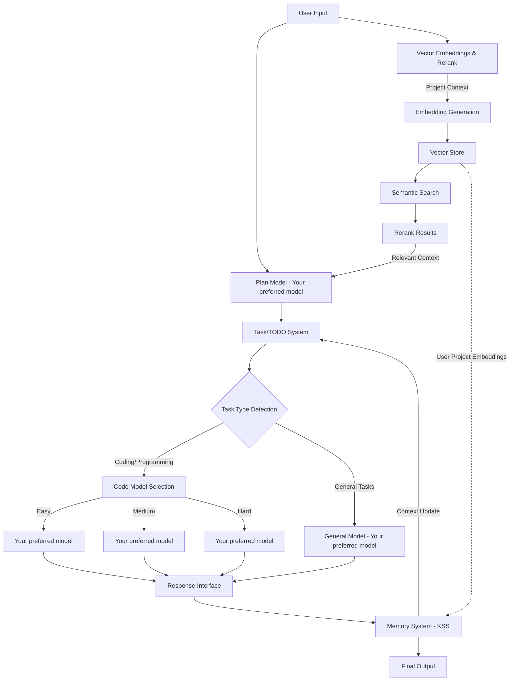

# Knox Memory System (knox-ms) 模型

## 概述

**Knox Memory System (knox-ms)** 是一个革命性的自定义 AI 模型，通过像人脑一样运作的智能记忆管理系统，提供**真正无限的上下文窗口长度**。与受固定上下文窗口限制的传统 LLM（即使有上下文缓存）不同，knox-ms 通过复杂的计划-任务-记忆架构编排多个底层模型来突破这些限制。

<iframe width="900" height="600" src="https://www.youtube.com/embed/y10ez14CcI0?si=whude9nfdYNQ79PH" title="YouTube video player" frameborder="0" allow="accelerometer; autoplay; clipboard-write; encrypted-media; gyroscope; picture-in-picture; web-share" referrerpolicy="strict-origin-when-cross-origin" allowfullscreen></iframe>

### 核心创新：无限上下文

knox-ms 的核心突破是其**记忆系统**——一个存储在 Knox Server System(KSS) 中的动态、自更新知识库，它：

- **像大脑一样运作**：在无限次对话中维护持久、有组织的记忆
- **CRUD 操作**：根据任务执行动态地创建、读取、更新和删除记忆条目
- **上下文缓存集成**：与 LLM 上下文缓存（提示缓存）无缝配合以优化性能
- **智能记忆管理**：自动决定哪些内容需要记住、更新或遗忘
- **层级组织**：从近期（完整细节）到长期（语义摘要）结构化信息

### 架构理念

```
Memory System (大脑) = 核心智能
  ↓ 管理和更新
Context Cache (LLM) = 工作记忆
  ↓ 增强于
Vector Embeddings & Rerank (工具) = 信息检索
```

**工作原理**：
1. **记忆系统**作为持久化大脑，存储所有会话历史、计划和学习到的模式
2. **LLM 上下文缓存**作为工作记忆，由记忆系统的智能加载优化
3. **向量嵌入**提供在需要时检索相关用户项目上下文的工具

这种架构使 knox-ms 能够处理任何规模的对话和项目——从简短查询到跨月开发项目——而不会丢失上下文或达到 token 限制。

## 模型身份

```json
{
    "id": "knox/knox-ms",
    "object": "model",
    "created": 1735689600,
    "owned_by": "KnoxChat",
    "root": "knox/knox-ms",
    "parent": null
}
```

## 架构

### 核心组件



### 1. 计划模型

- **默认模型**：`Your preferred model`
- **用途**：分析输入并创建结构化的执行计划
- **输出**：带有难度分类（简单/中等/困难）的任务分解
- **职责**：
  - 解析用户意图
  - 将复杂请求分解为原子任务
  - 分配难度级别
  - 定义执行顺序和依赖关系

### 2. 任务/TODO 系统

作为智能任务管理器：
- 按类型（编码 vs. 非编码）分类任务
- 根据复杂度将任务路由到适当的模型
- 追踪任务进度和状态
- 管理任务依赖和执行顺序
- 记录任务完成情况和结果

**任务难度矩阵**：

| 难度 | 模型 | 使用场景 |
|------|------|----------|
| 简单 | `Your preferred model` | 简单查询、格式化、基本操作 |
| 中等 | `Your preferred model` | 中等复杂度、代码重构、分析 |
| 困难 | `Your preferred model` | 复杂推理、架构设计、高级编码 |

### 3. 向量嵌入与重排序系统

向量嵌入与重排序系统通过以下方式提供**智能上下文检索**：

- **用途**：将用户项目文件、代码和文档转换为语义向量以进行智能检索
- **范围**：与记忆系统分离——专注于用户的项目内容，而非 knox-ms 内部状态
- **组件**：
  - **嵌入生成**：将用户项目文件处理为向量嵌入
  - **向量存储**：存储带有元数据（文件路径、时间戳、类型）的嵌入
  - **语义搜索**：基于用户查询检索相关项目上下文
  - **重排序引擎**：使用高级排序算法按相关性重新排列搜索结果

**向量嵌入流水线**：

1. **索引阶段**（按需或后台）：
   ```
   User Project Files → Chunking → VoyageAI Embedding API → Vector Store
   ```
   - 支持的文件类型：`.rs`、`.py`、`.js`、`.ts`、`.md`、`.json`、`.yaml` 等
   - 分块大小：2048 个 token，带重叠
   - 嵌入模型：`voyage-3.5`（通用）或 `voyage-code-3`（代码导向项目）
   - API：VoyageAI Embeddings API

2. **检索阶段**（每次请求）：
   ```
   User Query → VoyageAI Query Embedding → Semantic Search → Top-K Results → VoyageAI Rerank → Final Context
   ```
   - Top-K：从向量搜索中获取 20-50 个候选项
   - 重排序模型：`rerank-2.5`（VoyageAI）
   - 最终选择：前 5-10 个最相关的分块

**与 Knox-MS 的集成**：
- 为计划模型提供相关项目上下文以更好地进行任务分解
- 为代码模型选择提供代码示例和模式
- 将项目特定知识与 knox-ms 内部记忆分离

**存储结构**：
```
KSS://knox-ms-vectors/
├── projects/
│   ├── {project_id}/
│   │   ├── metadata.json       # File index and metadata
│   │   ├── chunks/
│   │   │   ├── file_{hash}.json  # Chunked content with embeddings
│   │   └── index/
│   │       └── stats.json      # Indexing statistics
│   └── cache/
│       └── queries/            # Cached query results
```

### 4. 记忆系统

记忆系统是 **knox-ms 的大脑**——通过智能、动态的记忆管理提供真正无限的上下文：

#### 核心概念：类人记忆

正如人脑不会存储每个细节，而是根据相关性组织和更新记忆，knox-ms 记忆系统：

- **持久存储**：基于 KSS 的树结构文件系统，提供无限存储
- **动态 CRUD 操作**：根据任务执行持续地创建、读取、更新和删除记忆
- **智能组织**：自动以层级结构组织信息
- **上下文感知加载**：仅将相关记忆加载到 LLM 上下文缓存中
- **自我优化**：总结、压缩和重组记忆以保持效率

#### 记忆 vs. 上下文缓存 vs. 向量嵌入

| 组件 | 用途 | 范围 | 持久性 |
|------|------|------|--------|
| **记忆系统（大脑）** | 核心智能、会话历史、学习到的模式 | Knox-ms 内部状态 | 永久（KSS） |
| **LLM 上下文缓存** | 当前任务执行的工作记忆 | 当前请求/任务上下文 | 临时（每次请求） |
| **向量嵌入（工具）** | 检索用户项目信息 | 用户的代码库/文档 | 永久（KSS） |

记忆系统管理进入 LLM 上下文缓存的内容，而向量嵌入作为获取相关项目信息的工具。

#### 动态 CRUD 操作

记忆系统根据任务执行进行智能 CRUD 操作：

**CREATE（新信息）**：
- 新会话初始化 → 创建 `session/{session_id}/` 目录
- 新计划生成 → 创建 `plans/plan_{id}.md`
- 新任务开始 → 创建 `tasks/task_{id}.md`
- 发现新模式 → 在 `knowledge/patterns/` 中创建条目

**READ（上下文加载）**：
- 从 `history.md` 加载最近的对话
- 从 `plans/` 检索相关计划
- 从 `tasks/status.md` 获取任务状态
- 查询知识库以查找类似的过往情况

**UPDATE（记忆优化）**：
- 任务完成 → 用结果更新 `tasks/task_{id}.md`
- 对话继续 → 追加到 `history.md`
- 上下文增长过大 → 用摘要更新 `context.md`
- 新模式匹配已有模式 → 更新 `knowledge/patterns/`

**DELETE（记忆优化）**：
- 旧的临时文件 → 摘要化后删除
- 冗余信息 → 移除重复
- 失败/取消的任务 → 归档或删除
- 过期的缓存条目 → 使其失效并移除

#### KSS 存储结构

- **KSS 存储**：将所有 knox-ms 交互存储在 KSS 上的树结构文件系统中
- **Markdown 文件**：所有内容以 `.md` 文件形式持久化，便于人类阅读
- **动态更新**：根据计划和任务系统的执行自动更新相关文件
- **关注点分离**：
  - **记忆系统（KSS）**：Knox-ms 内部状态、会话历史、任务记录、计划
  - **向量嵌入**：用于上下文检索的用户项目内容、代码、文档

- **层级组织**（KSS）：
- **层级组织**（KSS）：
  ```
  KSS://knox-ms-memory/
  ├── sessions/
  │   ├── {session_id}/
  │   │   ├── context.md          # Current conversation context (optimized for cache)
  │   │   ├── history.md          # Full conversation history
  │   │   ├── tasks/
  │   │   │   ├── task_{id}.md    # Individual task records
  │   │   │   └── status.md      # Task status tracker
  │   │   └── plans/
  │   │       └── plan_{id}.md    # Execution plans
  │   └── summary.md              # Session summary
  ├── knowledge/
  │   ├── code/                   # Code-related memory
  │   ├── concepts/               # Learned concepts
  │   └── patterns/               # Recognized patterns
  └── index.md                    # Global memory index
  ```

#### 上下文缓存集成

记忆系统智能地管理 LLM 上下文缓存（提示缓存）：

**优化策略**：
1. **缓存优化加载**：组织记忆以最大化缓存命中率
2. **稳定前缀**：将常用上下文保持在稳定前缀中以利于缓存
3. **动态后缀**：追加每次请求变化的任务特定上下文
4. **缓存失效**：当记忆显著更新时进行智能失效
5. **Token 管理**：在缓存重用和新鲜上下文之间取得平衡

**记忆 → 缓存流程**：
```
Memory System (KSS) 
  → Load relevant memory 
  → Structure for optimal caching 
  → LLM Context Cache (prompt cache)
  → Execute task
  → Update Memory with results
  → Optimize cache structure
```

**优势**：
- **成本效率**：跨请求复用缓存上下文（降低输入 token 成本）
- **速度**：通过缓存提示加快响应时间
- **无限扩展**：记忆系统处理缓存无法处理的内容（无限历史）
- **智能**：记忆系统决定缓存什么 vs. 总结什么

#### 记忆能力

- **上下文优化**：持续优化和总结过往交互
- **相关检索**：仅提取当前任务所需的上下文
- **循环集成**：在任务执行期间持续更新
- **KSS 优势**：可扩展、持久、经济高效的无限记忆存储
- **跨会话学习**：在不同会话间共享知识
- **模式识别**：识别和记忆重复出现的模式

## API 规范

### 模型对象

```json
{
    "architecture": {
        "input_modalities": ["file", "image", "text"],
        "modality": "text+image->text",
        "output_modalities": ["text"],
        "tokenizer": "Claude"
    },
    "context_length": -1,
    "created": 1735689600,
    "id": "knox/knox-ms",
    "object": "model",
    "owned_by": "KnoxChat",
    "parent": null,
    "permission": [
        {
            "allow_create_engine": true,
            "allow_fine_tuning": false,
            "allow_logprobs": true,
            "allow_sampling": true,
            "allow_search_indices": false,
            "allow_view": true,
            "created": 1735689600,
            "group": null,
            "id": "modelperm-knox-ms-001",
            "is_blocking": false,
            "object": "model_permission",
            "organization": "*"
        }
    ],
    "pricing": {
        "completion": "0.000015",
        "image": "0",
        "input_cache_read": "0.0000003",
        "input_cache_write": "0.0000015",
        "internal_reasoning": "0",
        "prompt": "0.000003",
        "request": "0",
        "web_search": "0"
    },
    "root": "knox/knox-ms",
    "supported_parameters": [
        "enable_vector_search",
        "include_reasoning",
        "max_tokens",
        "memory_mode",
        "project_id",
        "reasoning",
        "rerank_threshold",
        "response_format",
        "session_id",
        "stop",
        "structured_outputs",
        "temperature",
        "tool_choice",
        "tools",
        "top_k",
        "vector_top_k",
        "verbosity"
    ],
    "top_provider": {
        "context_length": -1,
        "is_moderated": true,
        "max_completion_tokens": 128000
    }
}
```

### 特殊参数

| 参数 | 类型 | 描述 |
|------|------|------|
| `session_id` | string | 用于记忆持久化的唯一会话标识符 |
| `project_id` | string | 用于向量嵌入检索的用户项目标识符 |
| `enable_vector_search` | boolean | 启用向量嵌入搜索以获取项目上下文（默认：true） |
| `vector_top_k` | integer | 检索的向量搜索候选数量（默认：30） |
| `rerank_threshold` | float | 最低重排序分数阈值（0.0-1.0，默认：0.5） |
| `memory_mode` | string | 记忆策略：`full`、`summarized`、`selective` |
| `include_reasoning` | boolean | 在响应中包含任务规划推理 |
| `verbosity` | string | 输出详细级别：`minimal`、`normal`、`verbose` |

### 请求格式

```json
{
    "model": "knox/knox-ms",
    "messages": [
        {
            "role": "user",
            "content": "Build a REST API with user authentication"
        }
    ],
    "temperature": 0.7,
    "max_tokens": 8192,
    "stream": true,
    "session_id": "session_abc123",
    "project_id": "proj_xyz789",
    "enable_vector_search": true,
    "vector_top_k": 30,
    "rerank_threshold": 0.5,
    "memory_mode": "full",
    "include_reasoning": true
}
```

### 响应格式（流式）

```json
{
    "id": "chatcmpl-knox-ms-xxx",
    "object": "chat.completion.chunk",
    "created": 1735689600,
    "model": "knox/knox-ms",
    "choices": [
        {
            "index": 0,
            "delta": {
                "role": "assistant",
                "content": "..."
            },
            "finish_reason": null
        }
    ],
    "knox_ms_meta": {
        "current_task": "task_001",
        "task_status": "in_progress",
        "plan_id": "plan_001",
        "model_used": "Your preferred model",
        "memory_tokens_saved": 45000,
        "vector_search": {
            "enabled": true,
            "chunks_retrieved": 8,
            "rerank_score_avg": 0.78,
            "retrieval_time_ms": 145
        }
    }
}
```

### 响应格式（非流式）

```json
{
    "id": "chatcmpl-knox-ms-xxx",
    "object": "chat.completion",
    "created": 1735689600,
    "model": "knox/knox-ms",
    "choices": [
        {
            "index": 0,
            "message": {
                "role": "assistant",
                "content": "..."
            },
            "finish_reason": "stop"
        }
    ],
    "usage": {
        "prompt_tokens": 150,
        "completion_tokens": 2500,
        "total_tokens": 2650
    },
    "knox_ms_meta": {
        "tasks_completed": 5,
        "plans_executed": 1,
        "total_model_calls": 8,
        "memory_operations": {
            "reads": 12,
            "writes": 5
        },
        "vector_search": {
            "enabled": true,
            "total_chunks_retrieved": 8,
            "rerank_score_avg": 0.78,
            "retrieval_time_ms": 145,
            "project_files_indexed": 342
        }
    }
}
```

## 工作流程详解

### 1. 请求处理流程

```
1. 接收用户输入
2. 记忆系统加载（如提供了 session_id）：
   a. READ：从 KSS 加载会话上下文
   b. READ：解析相关历史和任务状态
   c. 组织记忆以实现最优 LLM 上下文缓存
   d. 准备稳定前缀（可缓存）+ 动态后缀（新上下文）
3. 向量嵌入与重排序（如提供了 project_id 且已启用）：
   a. 通过任意向量数据库从用户输入生成查询嵌入
   b. 在项目向量存储（KSS）中执行语义搜索
   c. 检索 Top-K 候选分块
   d. 使用任意 rerank 模型按相关性重排序结果
   e. 提取最相关的项目上下文
4. 计划模型分析输入 + 记忆上下文 + 项目上下文
   - 利用 LLM 上下文缓存提高效率
   - 记忆系统提供相关的历史上下文
5. 任务/TODO 系统接收结构化计划
6. 对于每个任务：
   a. 确定任务类型（编码/通用）
   b. 评估难度（简单/中等/困难）
   c. 选择适当的模型
   d. UPDATE：在记忆系统（KSS）中创建任务记录
   e. 使用相关记忆上下文（已缓存）执行任务
   f. 向用户流式传输响应
   g. UPDATE：将任务结果写入记忆系统
   h. UPDATE：更新任务状态
7. 记忆系统 CRUD 操作：
   a. UPDATE：追加到 history.md
   b. UPDATE：如需要则用摘要优化 context.md
   c. CREATE/UPDATE：将学到的模式保存到知识库
   d. DELETE：移除临时文件
   e. 为下次请求的上下文缓存进行优化
8. 返回带有元数据的最终响应
```

### 2. 记忆管理流程（CRUD 操作）

```
1. 请求开始时（READ）：
   - READ：从 KSS 加载会话上下文
   - READ：解析 history.md 以获取相关上下文
   - READ：从任务状态构建工作上下文
   - READ：获取相关知识库条目
   - 组织加载的记忆以优化 LLM 上下文缓存
   - 如提供了 project_id 则触发向量搜索（工具操作）

2. 执行期间（CREATE/UPDATE）：
   - CREATE：初始化新的任务记录（tasks/task_{id}.md）
   - UPDATE：实时更新任务状态（tasks/status.md）
   - UPDATE：将中间结果写入 KSS 上的任务文件
   - UPDATE：维护运行中的上下文摘要
   - 缓存会话的向量搜索结果（工具缓存）
   - UPDATE：将重要事件追加到 history.md

3. 请求完成时（UPDATE/DELETE/CREATE）：
   - UPDATE：将完整交互追加到 KSS 上的 history.md
   - UPDATE：优化 context.md（如超出阈值则进行摘要）
   - CREATE/UPDATE：将新模式添加到 knowledge/patterns/
   - UPDATE：将最终任务状态和结果写入 KSS
   - DELETE：移除临时/冗余数据
   - UPDATE：重组记忆结构以实现最优缓存
   - CREATE：如创建了新项目文件则更新向量嵌入（工具更新）
   - UPDATE：使过期缓存条目失效

4. 记忆优化（后台）：
   - 分析记忆使用模式
   - 将旧对话压缩为摘要
   - 归档已完成的会话
   - 构建语义索引以加快检索
```

### 3. 向量嵌入索引流程（工具操作）

**注意**：向量嵌入作为检索用户项目信息的*工具*，而非大脑/记忆。

```
1. 项目索引（由 API 或 webhook 触发）：
   - 扫描项目目录中支持的文件类型
   - 过滤二进制文件、构建产物、node_modules 等
   - 将文件分割为语义段（2048 个 token，256 个重叠）
   - 使用任意向量数据库 API 生成嵌入（voyage-3.5 或 voyage-code-3）
   - 将分块和嵌入存储在 KSS 中（KSS://knox-ms-vectors/）
   - 更新项目索引统计

2. 增量更新（文件变更时）：
   - 通过文件哈希比较检测变更文件
   - 通过任意向量数据库重新分块和重新嵌入修改的文件
   - 用新嵌入更新 KSS 向量存储
   - 使相关查询缓存失效

3. 查询处理（每次请求 - 工具使用）：
   - 通过任意向量数据库从用户输入生成查询嵌入
   - 在向量存储（KSS）中执行余弦相似度搜索
   - 检索 Top-K 候选项（例如 K=30）
   - 将候选项传递给任意 rerank 模型
   - 选择 Top-N 结果（例如 N=8）
   - 为计划模型格式化上下文
   - 在会话中缓存结果以供复用
```

### 4. 上下文优化策略

记忆系统（大脑）和向量嵌入（工具）协同工作以实现无限上下文：

**记忆系统（大脑 - 基于 KSS）**：
1. **滑动窗口**：保持最近 N 个 token 的完整细节以提供即时上下文
2. **智能摘要**：压缩较早的交互同时保留关键洞察
3. **语义索引**：索引重要概念、决策和模式以便检索
4. **选择性加载**：仅将相关记忆段加载到 LLM 上下文缓存中
5. **层级压缩**：
   - 近期（最近几轮）：包含所有上下文的完整细节
   - 中期（上一会话）：关键要点和决策
   - 长期（历史）：语义摘要和模式
6. **上下文缓存优化**：组织记忆以最大化 LLM 提示缓存命中
7. **动态 CRUD**：根据任务执行持续更新记忆
8. **模式识别**：从过往交互中学习并应用于新情况

**向量嵌入（工具 - 项目上下文检索）**：
1. **语义搜索**：通过任意向量数据库基于查询含义检索相关代码/文档
2. **重排序**：使用任意 rerank 模型进行细粒度相关性评分
3. **缓存**：缓存频繁查询结果以加快检索
4. **增量索引**：仅更新变更文件以减少开销
5. **元数据过滤**：按文件类型、时间或项目区域预过滤

**集成**：
- 记忆系统管理加载什么上下文以及何时加载
- 向量嵌入提供获取相关项目信息的工具
- LLM 上下文缓存受益于记忆系统的智能组织
- 三者协同工作以突破上下文窗口限制

knox-ms 模型通过其智能记忆管理系统提供**真正无限的上下文**，使跨月开发项目在不丢失上下文或达到 token 限制的情况下成为可能。

[**>>> Knox-MS 无限上下文定理**](../knox-ms-unlimited-formula)
