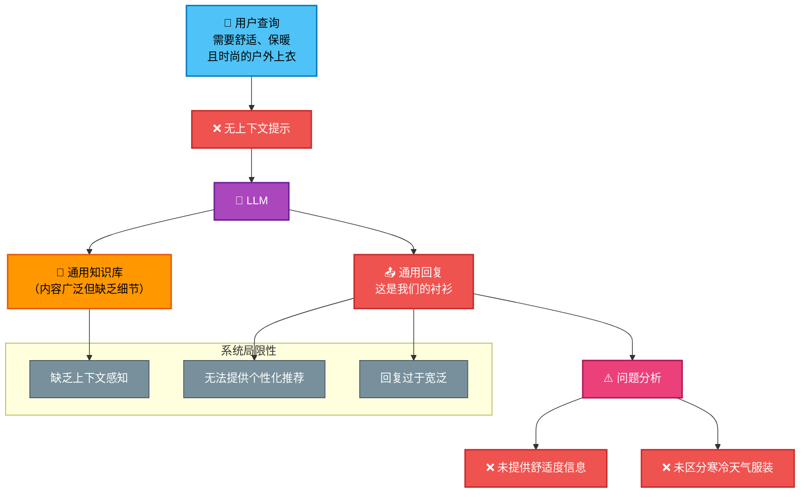
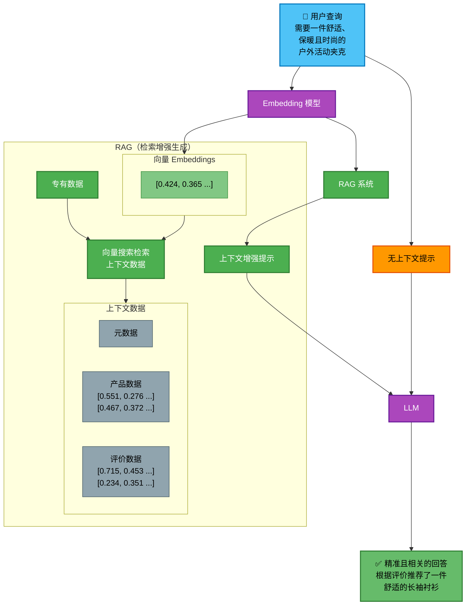

import Tabs from '@theme/Tabs';
import TabItem from '@theme/TabItem';

# Embeddings 与 Rerankers

## 简介

Knox 集成了 Voyage AI 最前沿的 Embedding 和 Reranking 技术。

**Embedding** 模型是基于神经网络的模型（如 Transformers），能够将非结构化的复杂数据（如文档、图片、音频、视频或表格数据）转换为密集的数值向量（即 Embeddings），以捕获语义信息。这些向量作为数据点的表示或索引，是语义搜索和检索增强生成（RAG）的核心组件——RAG 是当今构建领域专属或企业级聊天机器人及其他 AI 应用的主流方法。

**Reranking** 模型是能够输出查询与多个文档之间相关性分数的神经网络。常见做法是利用这些分数对最初通过 Embedding 方法（或 BM25、TF-IDF 等词法搜索算法）检索到的文档进行重新排序。筛选出得分最高的文档，可以将检索结果优化为更具相关性的子集。

我们同时提供 Embedding 和 Reranking 模型的 API 接口，接受你的数据（如文档、查询或查询-文档对），并返回相应的 Embedding 向量或相关性分数。Embedding 模型和 Rerankers 作为模块化组件，可与 RAG 技术栈的其他部分（如向量数据库和生成式大语言模型，即 LLMs）无缝集成。

## 什么是检索增强生成？

检索增强生成（RAG）是一种流行的生成式 AI 框架，通过在生成过程中融入相关的最新信息来增强大语言模型（LLMs）的能力。这种方法允许 LLMs 用当前的领域特定数据补充其预训练知识。RAG 是一种经济高效的解决方案，无需进行昂贵且耗时的微调或重新训练整个模型，即可针对特定用例定制 LLMs。

### 检索增强生成：驱动更智能的 AI
检索增强生成使企业能够利用通用 LLMs 构建领域特定应用，而无需依赖昂贵的定制训练模型。RAG 直接应对这些模型的核心局限——通过在查询中注入当前的领域特定信息来增强生成能力。这使得企业能够整合实时更新、专有数据集以及原始模型训练中未涵盖的专业文档。通过透明地提供有证据支持的响应，RAG 提升了可信度并降低了幻觉风险。

### 什么是大语言模型？
大语言模型（LLMs）是一种旨在理解和生成类人文本的人工智能。作为自然语言处理（NLP）的高级应用，LLMs 从海量训练数据中学习模式、结构和语法规则，从而能够对用户提示生成连贯的回复。其优势在于无需针对特定任务训练即可执行广泛的语言生成任务，使其成为聊天机器人、翻译、内容创作、摘要生成等领域的通用工具。

### 大语言模型的局限性
大语言模型是在海量数据集上训练的复杂神经网络。开发这些模型需要巨大的计算资源，使得该过程既昂贵又耗时。此外，托管和维护定制 LLMs 所需的专业基础设施带来了显著的财务门槛，将其可及性限制在拥有大量技术投资的资源充足的组织中。

LLMs 擅长回答与历史/已记录内容相关的问题，但其知识受限于训练数据的时效性。对于需要最新信息的查询，如不重新训练，它们无法有效回应最近事件。

同样，LLMs 无法直接回答关于企业内部文档或其他组织特定数据集的问题。这一局限对于寻求通过 AI 获得深度领域专业知识的企业构成了重大挑战。

这些不足还凸显了 LLMs 的另一个重要问题：幻觉。在缺乏可验证信息的情况下，语言模型可能生成看似合理但完全虚构的回复。这种倾向对要求准确性和可靠性的应用构成了重大风险。

#### 未经 RAG 增强的 LLM 系统示意图

下图展示了未经 RAG 增强的 LLM 系统的工作流程及其局限性：

该图清楚地说明了：
- **用户需求**：具体且具有上下文感知的查询
- **系统处理**：缺乏上下文的通用 LLM 处理
- **输出结果**：模糊且不具体的回复
- **核心问题**：无法提供个性化、精准的推荐

### 检索增强生成（RAG）的优势
RAG 因其架构相对简单且性能提升显著而广受欢迎。

**经济高效**
RAG 使组织能够将通用预训练模型适配到专业领域，而无需承担定制模型的高昂开发成本。通过仅检索相关信息，它优化了基于 Token 的 LLM 使用，降低了 API 费用。

**领域定制**
RAG 允许组织集成专业知识库，将预训练模型适配到特定领域。这使得无需额外训练即可直接回答关于专有文档或行业特定内容的问题。虽然微调可以达到类似效果，但其时间、成本和维护开销远高于 RAG。

**实时洞察**
通过动态检索最新的外部数据，RAG 使 LLMs 能够基于最新信息生成回复。这克服了静态训练数据集的局限性，支持对近期事件和新兴趋势的分析。

**透明性**
RAG 通过为生成的内容提供来源引用和证据来增强可靠性。通过将回复链接到知识库中的特定参考资料，用户可以验证准确性和来源，降低幻觉风险并增强对 AI 输出的信任。

**适应性**
RAG 的核心优势之一是其与前沿模型的易集成性。随着语言模型或检索技术的进步，组织可以直接升级或调整检索策略而无需进行系统级改造，确保技术的持续相关性。

### 检索增强生成（RAG）的工作原理
RAG 涉及三个关键阶段：数据摄取、检索和生成。

**数据摄取**
在摄取阶段，知识库被准备用于检索。来自内部文档、数据库或外部来源的原始数据经过清洗、格式化并分割为可管理的块。每个块通过 Embedding 模型转换为向量表示（捕获文本语义），并存储在向量数据库中以便高效的语义搜索。

**信息检索**
当用户提交查询时，系统在生成之前检索相关上下文。查询使用相同的 Embedding 模型进行向量化。然后向量搜索引擎检索与查询语义最接近的文档块，可选地通过过滤、排序或加权进行优化，以确保仅返回最相关的信息。

**生成阶段**
检索到相关上下文后，系统构建一个增强提示，结合原始查询、检索到的段落和特定指令。LLM 利用其预训练知识和检索到的内容生成回复，确保准确性和与用户意图的一致性。

#### RAG 增强 LLM 系统示意图

下图展示了 RAG 系统如何通过检索上下文信息来增强 LLM 响应：

此 RAG 增强系统的关键优势：
- **智能检索**：通过向量 Embeddings 找到最相关的上下文信息。
- **精准回答**：结合专有数据和用户查询生成具体推荐。
- **可验证性**：回答基于实际产品数据和用户评价。
- **个性化**：通过考虑特定需求（如户外活动、舒适度、保暖性、风格）提供量身定制的建议。

### 检索增强生成（RAG）的行业应用
RAG 已在多个行业得到应用，释放了大语言模型（LLMs）和 AI 的变革潜力。

**制造业**：通过设备手册和维护日志增强 LLMs，提供实时操作指导。RAG 使技术人员能够快速获取精确的机器信息，减少停机时间并提升设备性能。

**客户支持**：利用内部文档、产品指南和支持历史记录来诊断问题。RAG 帮助支持团队即时检索有用内容，缩短响应时间并提高首次联系解决率，实现客户查询的高效处理。

**医疗保健**：整合医学研究、临床指南和患者记录，支持诊断决策和治疗建议。RAG 使医疗专业人员能够获取最新的医学知识，同时提供透明的、有证据支持的见解。

**金融服务**：结合监管文件、市场报告和合规指南，支持投资研究、风险评估和法规遵从。RAG 使金融分析师能够快速检索和分析复杂的、最新的金融信息。

**软件工程**：参考文档和代码片段帮助工程师编写代码。RAG 还通过根据类似记录的问题建议潜在修复方案来辅助调试，提升生产力和代码质量。

### 检索增强生成的关键概念

**分块（Chunking）**
分块是数据摄取过程的一部分，能够提升系统准确性并降低成本。它将大型内容分割为较小的、可管理的片段用于检索。目标是创建有意义且上下文完整的块，保留足够的信息同时最小化冗余。

有效的分块需要在粒度和完整性之间取得平衡，使系统能够检索相关信息而不会用无关细节淹没 LLM。良好的分块结构可以增强检索精度、减少 Token 使用量，并生成更准确、更经济的回复。

**Embedding 模型**
Embedding 模型将数据转换为称为"向量"的数值表示，以捕获语义含义。这使得系统能够理解单词、短语和文档之间的关系，提升检索准确性。

在摄取阶段，Embedding 模型处理每个块并将其转换为向量，存储在向量数据库中。当用户提交查询时，系统使用相同的 Embedding 模型将查询转换为向量。

不同的 Embedding 模型支持不同的用例。通用模型适用于广泛场景，而领域特定模型（如法律、医疗或金融）可在专业领域增强检索准确性。多模态模型不仅处理文本，还处理图片、音频和其他数据类型，实现高级检索能力。某些模型可以生成文本的数值表示，用于与图片或视频的直接比较，实现真正的多模态检索。

**语义搜索**
语义搜索通过关注用户查询背后的含义来改进关键词搜索。利用 Embeddings，查询和文档被转换为捕获语义的向量。即使确切的查询词未出现在内容中，向量数据库仍然可以找到最相关的文档。

这种方法更好地理解上下文，确保更准确和更相关的结果。通过识别同义词、相关概念和词语变体，语义搜索增强了用户体验并减少了歧义，使结果更符合意图。

**重排序（Reranking）**
重排序是一种在初始检索之后优化结果相关性的技术。在检索到一组文档后，重排序模型根据其与查询的相关性对它们进行重新排序。该模型可能使用文档质量、上下文相关性或基于机器学习的评分等附加特征来优化结果。

重排序优先展示最有用的上下文信息，提高准确性和用户满意度。当初始检索返回广泛的结果集时，它特别有用，帮助系统精调选择并呈现最相关的答案。

**提示工程（Prompt Engineering）**
提示工程涉及精心设计输入给 LLM 的指令，以引导其生成期望的输出。有效的提示确保模型产生更准确、更相关和更合适的回复。这一过程包括提供清晰的指令、相关的上下文，有时还包括示例来帮助模型理解任务。

在 RAG 中，提示工程在将检索到的文档与原始用户查询结合生成连贯且精确的回复方面起着关键作用。精心设计的提示减少了歧义，过滤了无关信息，并确保与用户意图的一致性，提升输出质量。

### 优化检索增强生成应用
RAG 解决方案可以通过各种策略进行优化，以提升准确性和改善最终用户体验。

**优化信息检索**
改进 RAG 的信息检索包括：
1. 评估分块技术，确保文档被分割为有意义的、上下文相关的片段。
2. 选择合适的 Embedding 模型以捕获语义含义。领域特定模型可能在某些用例中表现更好。
3. 探索语义搜索和关键词搜索的混合方案以改进检索。
4. 在检索后应用重排序方法以优化结果准确性。
5. 调整检索文档的数量：过多会引入噪声，过少可能遗漏关键上下文。找到平衡可以提升性能。

**优化回答生成**
增强 RAG 的生成能力可以包括：
1. 使用提示工程来构建查询和上下文，引导 LLMs 生成更准确和更相关的回复。
2. 评估领域特定的 LLMs 以确保回复满足细微需求。
3. 调整模型参数（如 temperature）以控制创造性。

**优化生产环境扩展**
为生产就绪，RAG 系统必须集成最优组件：
- **向量数据库**：选择支持快速近似最近邻（ANN）搜索的可扩展平台。高级数据库还可能支持元数据过滤以缩小结果范围。
- **Embedding 模型**：在向量维度与存储和检索效率之间取得平衡。高维 Embeddings 捕获更丰富的语义但增加计算成本。
- **LLMs**：选择与用例需求匹配的模型。更大的模型可能提供更高的准确性但会增加延迟。

### 检索增强生成面临的挑战
一个主要挑战是整合和组织内容以实现高效检索。RAG 系统依赖于跨格式和平台分散的多样化数据，使得保持一致性和准确性变得困难。检索到的信息可能存在矛盾或过时，影响回复质量。

另一个局限是 RAG 目前仅限于回答查询，无法执行复杂操作。虽然擅长从检索到的数据生成回复，但 RAG 缺乏与现实环境的交互能力，限制了其问题解决和决策制定的潜力。

### 构建具有记忆功能的交互式 RAG
添加记忆使 RAG 系统能够保留过去交互的上下文，创造个性化体验。传统 RAG 缺乏连续性，但记忆机制允许系统回忆先前的事实和偏好，随时间调整回复以获得更具对话性的体验。

### RAG 和生成式 AI 的未来
新兴技术将增强 RAG 智能检索和生成信息的能力。关键趋势包括：
- **高级检索**：动态访问专业数据库和实时来源。
- **生成式 AI 智能体**：集成问题解决和决策能力，实现交互式和自主应用。

### 微调与检索增强生成的对比
**微调**：通过额外训练永久修改 LLMs，将知识嵌入模型参数中。这种方法资源密集且更新不灵活。

**RAG**：动态检索外部数据生成回复，提供灵活性和可扩展性而无需修改模型参数，非常适合知识密集型任务。

## 文本 Embeddings

可用的文本 Embedding 模型：

| 模型 | 上下文长度（Token 数） | Embedding 维度 | 描述 |
|----------|---------------|----------|------|
| `voyage-3-large` | 32,000 | 1024（默认）, 256, 512, 2048 | 最佳通用及多语言检索 |
| `voyage-3.5` | 32,000 | 1024（默认）, 256, 512, 2048 | 针对通用/多语言检索优化 |
| `voyage-3.5-lite` | 32,000 | 1024（默认）, 256, 512, 2048 | 针对延迟/成本优化 |
| `voyage-code-3` | 32,000 | 1024（默认）, 256, 512, 2048 | 针对**代码**检索优化 |
| `voyage-finance-2` | 32,000 | 1024 | 针对**金融**检索/RAG 优化 |
| `voyage-law-2` | 16,000 | 1024 | 针对**法律**检索/RAG 优化，通用性能提升 |
| `voyage-code-2` | 16,000 | 1536 | 针对代码检索优化（比替代方案高 17%）/ 旧版模型 |

## 多模态 Embeddings

多模态 Embedding 模型将来自多种模态（如文本、图片）的非结构化数据转换到共享向量空间。Voyage 的模型直接处理混合输入（如包含图表、幻灯片或截图的文本），不像 CLIP 等传统模型需要分别处理各个模态。

**可用的 Voyage 多模态模型：**

| 模型 | 上下文长度（Token 数） | Embedding 维度 | 描述 |
|----------|---------------|----------|------|
| `voyage-multimodal-3` | 32,000 | 1024 | 强大的多模态模型，支持文本/图片混合输入（如 PDF、幻灯片、表格）。 |

## 重排序（Reranking）

Rerankers 用于优化查询与文档之间的相关性排序，通常在初始检索（如通过 Embeddings 或 BM25）之后使用。与 Embeddings 不同，Rerankers 是交叉编码器，联合处理查询和文档以进行精确的相关性评分。

**可用的 Voyage Rerankers：**

| 模型 | 上下文长度（Token 数） | 描述 |
|----------|---------------|------|
| `rerank-2` | 16,000 | 通用、多语言、质量优化 |
| `rerank-2-lite` | 8000 | 通用、多语言、延迟/质量优化 |
